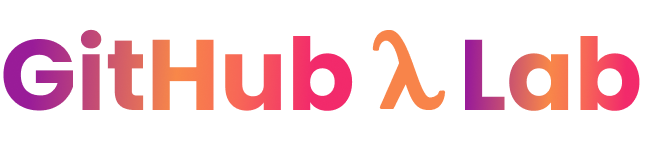

  

<h1 align="center">Welcome to my lab!</h1>

  <b><a href="#-github-λ-lab">GitHub Lab</a></b> 
  •
  <b><a href="#-linguagens-de-programação">Linguagens de Programação</a></b> 
  •
  <b><a href="#-objetivos">Objetivos</a></b>

## 📁 GitHub λ Lab

Esse repositório é destinado ao arquivamento de resumos e exercícios realizados durante meus estudos. Fique a vontade para aprender junto comigo e até mesmo compartilhar seu conhecimento com sugestões e feedbacks.

## 💻 Linguagens de Programação

As linguagens que estarão aqui neste repositório irão de acordo com meus objetivos atuais, pois meu estudo varia de acordo com a necessidade ou com a minha curiosidade.

## 🎯 Objetivos

O GitHub Lab tem por objetivo o agrupamento das informações, por estar em um repositório remoto traz a praticidade de acessar a qualquer momento (além de segurança) e também permite que outras pessoas acessem este mesmo conteúdo, ou seja, é destinado tanto para eventuais consultas como um modo seguro de arquivamento quanto para contribuir com o estudo de outrem.

## Conteúdos

### Básico de JavaScript
📂  [pasta do repositório](https://github.com/gabjohann/GithubLab/tree/main/javascript) 

📚 [material base](https://www.youtube.com/playlist?list=PLm-VCNNTu3LnlPhqxx03kvjQd3qF6EBdz)